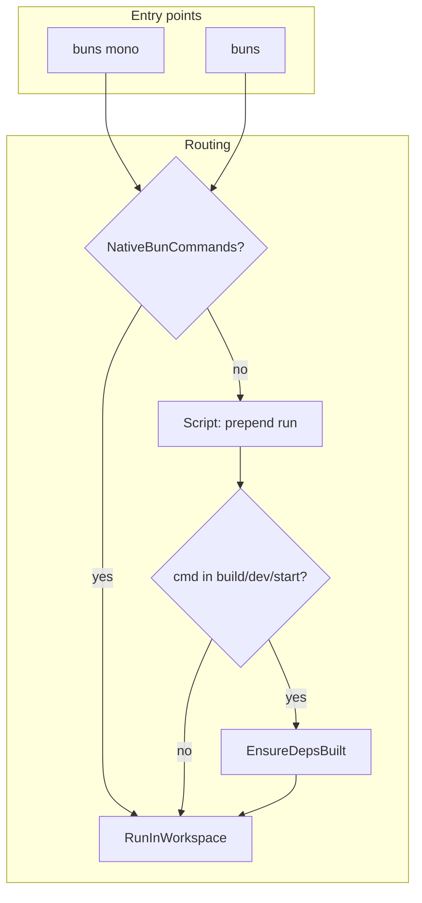

# Plan Sprint 1: Run unificado + reserved names + run vs native

## Flujo objetivo

## 1. Crear ReservedNames.ts

**Archivo:** [packages/cli/src/modules/mono/domain/services/ReservedNames.ts](packages/cli/src/modules/mono/domain/services/ReservedNames.ts)

- Set inmutable con: `generate`, `gen`, `build`, `dev`, `start`, `sync`, `remove`, `add`, `install`, `init`, `mono`, `pm`, `x`, `create`, `link`, `unlink`, `outdated`, `update`, `run`, `help`, `--help`, `-h`, `--version`, `-v`
- Función `isReserved(name: string): boolean`
- Exportar el set y la función

## 2. Crear NativeBunCommands.ts

**Archivo:** [packages/cli/src/modules/mono/domain/services/NativeBunCommands.ts](packages/cli/src/modules/mono/domain/services/NativeBunCommands.ts)

- Set: `add`, `install`, `remove`, `x`, `link`, `unlink`, `pm`, `outdated`, `update`, `create`
- Función `isNativeBunCommand(cmd: string): boolean`
- Estos comandos se pasan directo a `bun` sin anteponer `run`

## 3. Validación en AddAppUseCase y AddPackageUseCase

**Archivo:** [packages/cli/src/modules/mono/app/use-cases/AddAppUseCase.ts](packages/cli/src/modules/mono/app/use-cases/AddAppUseCase.ts)

- Tras cargar config y antes de verificar duplicados: `if (isReserved(name)) throw new Error(\`"${name}" is a reserved name. Choose a different workspace name.)`

**Archivo:** [packages/cli/src/modules/mono/app/use-cases/AddPackageUseCase.ts](packages/cli/src/modules/mono/app/use-cases/AddPackageUseCase.ts)

- Mismo check usando `isReserved(name)`

## 4. MonoCommand: fallthrough como `mono <alias> <cmd>`

**Archivo:** [packages/cli/src/modules/mono/app/MonoCommand.ts](packages/cli/src/modules/mono/app/MonoCommand.ts)

Reemplazar el fallthrough actual (líneas 76-78 que loguean) por:

1. Si `extraArgs.length === 0`: error "Usage: buns mono  <script|cmd> [args...]"
2. Load config, verificar que `subcommand` sea alias válido vía `isWorkspaceAlias(repo, subcommand)`
3. Si no: `console.error(\`Unknown subcommand or workspace: ${subcommand})` y exit 1
4. Si sí: llamar a nuevo método `handleRunInWorkspace(subcommand, extraArgs)`

## 5. MonoCommand: handleRunInWorkspace

**Archivo:** [packages/cli/src/modules/mono/app/MonoCommand.ts](packages/cli/src/modules/mono/app/MonoCommand.ts)

Crear `private async handleRunInWorkspace(workspaceId: string, args: string[]): Promise<void>`:

- `cmd = args[0]`, `rest = args.slice(1)`
- `bunArgs`: si `isNativeBunCommand(cmd)` → `[cmd, ...rest]`, sino → `['run', cmd, ...rest]`
- Si `cmd` ∈ {build, dev, start}: `await this.ensureDepsBuilt.execute(cwd, workspaceId)`
- `await this.runInWorkspace.execute(cwd, workspaceId, bunArgs)`
- try/catch con error claro

## 6. MonoCommand: añadir `start` a handleBuildOrDev

**Archivo:** [packages/cli/src/modules/mono/app/MonoCommand.ts](packages/cli/src/modules/mono/app/MonoCommand.ts)

- En `execute`, añadir rama: `if (subcommand === 'start') { await this.handleBuildOrDev('start', extraArgs); return; }`
- Cambiar firma de `handleBuildOrDev(script: 'build' | 'dev' | 'start', args: string[])`

## 7. index.ts: run vs native + EnsureDepsBuilt para start

**Archivo:** [packages/cli/src/index.ts](packages/cli/src/index.ts)

Cambios en el bloque default (líneas 106-141):

1. Importar `isNativeBunCommand` desde `NativeBunCommands.ts`
2. Incluir `start` en `isBuildOrDev`: añadir `commandArgs[0] === 'start'` y `commandArgs[1] === 'start'` en la condición
3. Para `runArgs`: si `commandArgs.length > 0` y `isNativeBunCommand(commandArgs[0])` → `runArgs = commandArgs` (sin prepender `run`). Sino, mantener lógica actual: si `commandArgs[0] !== 'run'` entonces `['run', ...commandArgs]`

## 8. MonoCommand: actualizar showUsage

**Archivo:** [packages/cli/src/modules/mono/app/MonoCommand.ts](packages/cli/src/modules/mono/app/MonoCommand.ts)

- Añadir línea: `buns mono start <alias>     Run start script (builds deps first)`
- Añadir línea con ejemplo: `buns mono <alias> <script>   Run script in workspace (e.g. buns mono app-example test)`
- Añadir: `buns mono <alias> add <pkg>   Run bun command in workspace (e.g. buns mono app-example add lodash)`

## Orden de implementación recomendado

| Orden | Tarea                                          | Dependencias               |
| ----- | ---------------------------------------------- | -------------------------- |
| 1     | ReservedNames.ts                               | ninguna                    |
| 2     | NativeBunCommands.ts                           | ninguna                    |
| 3     | AddAppUseCase + AddPackageUseCase validation   | ReservedNames              |
| 4     | MonoCommand handleRunInWorkspace + fallthrough | NativeBunCommands          |
| 5     | MonoCommand start subcommand                   | handleBuildOrDev existente |
| 6     | index.ts run vs native + start                 | NativeBunCommands          |
| 7     | MonoCommand showUsage                          | ninguna                    |
| 8     | Build + verificación manual                    | todo                       |

## Verificación manual

- `buns mono app-example test` → ejecuta `bun run test`
- `buns mono app-example add lodash` → ejecuta `bun add lodash`
- `buns app-example add lodash` → mismo vía direct run
- `buns mono app-example build` / `dev` / `start` → EnsureDepsBuilt + script
- `buns mono gen app build` → error "build is a reserved name"
- `buns mono gen pkg add` → error "add is a reserved name"
