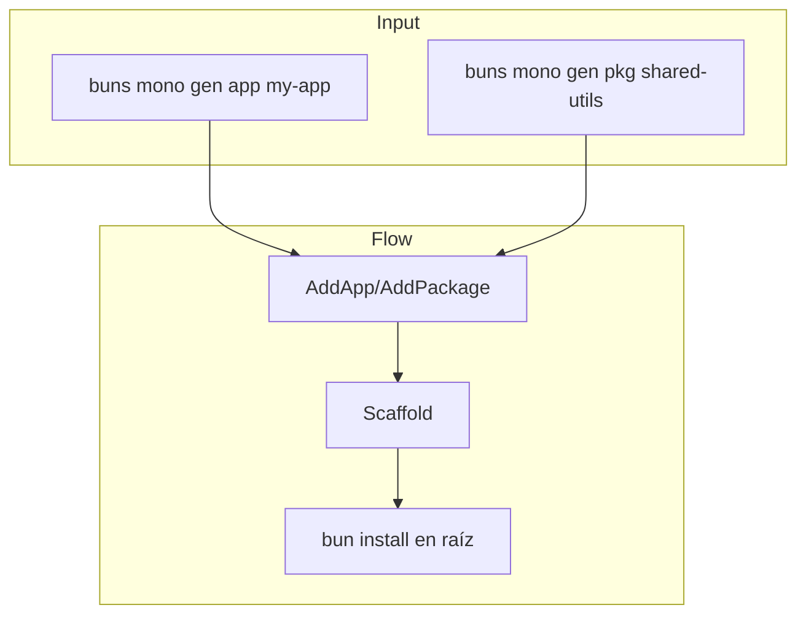

# Plan Sprint 3: bun install después de generate

## Objetivo

Tras `buns mono gen app my-app` o `buns mono gen pkg shared-utils`, ejecutar `bun install` en la raíz para actualizar el lockfile y que el nuevo workspace quede resuelto.

## Flujo objetivo

## 1. RunBunInstall.port.ts

**Archivo:** [packages/cli/src/modules/mono/domain/ports/RunBunInstall.port.ts](packages/cli/src/modules/mono/domain/ports/RunBunInstall.port.ts)

- Interface: `RunBunInstallPort`
- Método: `execute(cwd: string): Promise<void>`
- Descripción: ejecuta `bun install` en el directorio cwd (monorepo root)

## 2. BunRunBunInstallAdapter.ts

**Archivo:** [packages/cli/src/modules/mono/infra/adapters/BunRunBunInstallAdapter.ts](packages/cli/src/modules/mono/infra/adapters/BunRunBunInstallAdapter.ts)

- Implementa `RunBunInstallPort`
- `Bun.spawn(['bun', 'install'], { cwd, stdout: 'inherit', stderr: 'inherit', stdin: 'inherit' })`
- Esperar `proc.exited` y si exitCode !== 0, `process.exit(exitCode ?? 1)`
- Patrón igual que BunRunInWorkspaceAdapter pero sin workspaceDir ni args variables

## 3. MonoCommand: inyectar RunBunInstallPort

**Archivo:** [packages/cli/src/modules/mono/app/MonoCommand.ts](packages/cli/src/modules/mono/app/MonoCommand.ts)

- Añadir `runBunInstall: RunBunInstallPort` en MonoCommandProps
- Inyectar en constructor
- En `handleGenerate`, después de `await this.scaffolder.scaffoldApp(...)` o `scaffoldPackage(...)` y antes del `console.log`, llamar: `await this.runBunInstall.execute(cwd)`

## 4. MonoCommandFactory: crear y pasar RunBunInstallPort

**Archivo:** [packages/cli/src/modules/mono/infra/factories/MonoCommandFactory.ts](packages/cli/src/modules/mono/infra/factories/MonoCommandFactory.ts)

- Crear instancia: `new BunRunBunInstallAdapter()`
- Pasarla a MonoCommand como `runBunInstall`

## Orden de implementación

| Orden | Tarea | Archivos |
| ----- | ----- | -------- |
| 1 | RunBunInstall.port.ts | new |
| 2 | BunRunBunInstallAdapter.ts | new |
| 3 | MonoCommand handleGenerate + props | modify |
| 4 | MonoCommandFactory wire | modify |
| 5 | Build + verificación manual | verify |

## Verificación manual

- `buns mono gen app test-app` → tras scaffold, ejecuta `bun install` en raíz.
- `buns mono gen pkg test-pkg` → igual.
- El lockfile se actualiza.
- 0 lint errors, build succeeds.
