# Informe Agente de Capacidad Operativa

## Situación
**Caso**: CASO DOS - Evaluando una Idea
**Objetivo**: Evaluar viabilidad y generar planes de acción ejecutables

## Viabilidad
**Conclusión**: Evaluación en proceso de completar

## Análisis Detallado

## 1. Resumen Ejecutivo de la Propuesta
La propuesta busca crear un **Registro Municipal de Organizaciones Comunitarias** en Nueva York para centralizar, georreferenciar y gestionar la información de juntas vecinales, clubes y colectivos. El objetivo es mejorar la articulación de políticas y la asignación de recursos. Como Agente de Capacidad Operativa, evalúo esto no como un problema de software, sino como un reto de **mantenimiento de datos y gobernanza**. La tecnología es fácil; mantener la base de datos viva y limpia en una ciudad con alta informalidad y rotación es el desafío estructural.

## 2. Evaluación de Viabilidad Operativa
La propuesta es **VIABLE CON AJUSTES**.
* **Factores de Viabilidad:** Existencia de infraestructura Salesforce en la ciudad (OTI), mandato claro de la Community Affairs Unit (CAU).
* **Bloqueos Operativos:** La fragmentación actual es severa. Intentar centralizar sin limpiar datos primero resultará en un fracaso ('Garbage in, Garbage out'). La dependencia de validación manual por parte de Community Boards saturados es un punto de falla crítico.
* **Brecha:** No existe hoy un equipo dedicado a la 'higiene de datos' comunitaria. Se requiere reasignación de roles.

## 3. Hallazgos Clave (Evidencia)
1. **Silos de Datos:** NYC Service, DYCD y CAU operan CRMs separados. Unificar requiere voluntad política y ETL complejo.
2. **Fatiga de Registro:** Las organizaciones pequeñas ya llenan múltiples formularios (VENDEX, PASSPort, Discretionary Funds). Otro registro sin valor claro tendrá baja adopción.
3. **Capacidad de CBs:** Los Community Boards promedian 3 empleados para atender a ~150k residentes. No pueden asumir carga administrativa pesada de validación.

## 4. Ajustes Necesarios (Refactorización)
* **Modelo de Datos:** Cambiar de 'Censo estático' a 'Perfil vivo'. Los datos deben caducar si no se confirman anualmente.
* **Incentivos:** Vincular el registro a la elegibilidad para permisos de eventos (SAPO) y fondos del Concejo.
* **Tecnología:** Uso obligatorio de **NYC.ID** para autenticación única.

## 5. Gráficos de Análisis FACTUM (Obligatorios)

### Heatmap de Capacidad Operativa

```mermaid
flowchart TD
 subgraph Base- Escenario Base (Actual)
P1- Procesos: 30%
R1- RR.HH.: 60%
G1- Gobernanza: 40%
T1- Tecnología: 50%
L1- Logística: 70%
end
 subgraph Recomendado- Escenario Recomendado (Con Ajustes)
P2- Procesos: 80%
R2- RR.HH.: 75%
G2- Gobernanza: 85%
T2- Tecnología: 90%
L2- Logística: 80%
end
 subgraph Ambicioso- Escenario Ambicioso
P3- Procesos: 60%
R3- RR.HH.: 50%
G3- Gobernanza: 65%
T3- Tecnología: 70%
L3- Logística: 60%
end

 style P1 fill:#F44336,color:#fff
 style R1 fill:#FFC107,color:#000
 style G1 fill:#F44336,color:#fff
 style T1 fill:#FFC107,color:#000
 style L1 fill:#FFC107,color:#000
 style P2 fill:#4CAF50,color:#fff
 style R2 fill:#FFC107,color:#000
 style G2 fill:#4CAF50,color:#fff
 style T2 fill:#4CAF50,color:#fff
 style L2 fill:#4CAF50,color:#fff
 style P3 fill:#FFC107,color:#000
 style R3 fill:#F44336,color:#fff
 style G3 fill:#FFC107,color:#000
 style T3 fill:#4CAF50,color:#fff
 style L3 fill:#FFC107,color:#000
```

```mermaid
gantt
 title Cronograma de Implementación - Escenario Recomendado
 dateFormat YYYY-MM-DD

 section Fase 1: Preparación & IT
 Auditoría de Datos y Diseño MDM :done, prep1, 2025-01-01, 30d
 Configuración Salesforce (OTI) :active, prep2, after prep1, 45d
 Definición de SOPs y Gobernanza :prep3, after prep1, 30d

 section Fase 2: Piloto (90 días)
 Capacitación Distritos Piloto :crit, pil1, after prep2, 15d
 Despliegue Campo (3 CBs) :pil2, after pil1, 60d
 Ajustes UX/UI Portal :pil3, after pil2, 15d

 section Fase 3: Escalamiento
 Expansión a 5 Boroughs :esc1, after pil3, 90d
 Integración API PASSPort :esc2, after esc1, 60d

 section Hitos Clave
 Go-live Técnico (MVP) :milestone, m1, after prep2, 0d
 Cierre Piloto (300 orgs) :milestone, m2, after pil2, 0d
 Cobertura Total (5k orgs) :milestone, m3, after esc1, 0d
```



## 6. Consideraciones de Riesgo
| Riesgo | Probabilidad | Impacto | Mitigación |
|--------|-------------|---------|------------|
| **Baja Adopción** | Alta | Crítico | Integración forzosa con solicitud de fondos y permisos. |
| **Calidad de Datos** | Media | Alto | Validación escalonada y limpieza automatizada pre-carga. |
| **Resistencia CBs** | Media | Medio | Proveer personal de apoyo temporal y herramientas móviles simples. |

## 7. Conclusión y Veredicto
**VEREDICTO: VIABLE CON AJUSTES.**
La propuesta es técnicamente sencilla pero operativamente compleja. Solo funcionará si se plantea como una consolidación de sistemas existentes (Salesforce/OTI) y no como un nuevo desarrollo aislado, y si se dota de recursos humanos temporales para la 'última milla' de validación en los distritos.

## Planes de Acción Ejecutables

### Plan 1: Plan de Unificación de Datos e Infraestructura Tecnológica (IT & Data Ops)

1. Ejecución de Auditoría de Datos y Arquitectura de Solución MDM (Master Data Management). QUÉ: Realizar un inventario exhaustivo y mapeo de campos de las bases de datos actuales de CAU, NYC Service, DYCD y listas de Community Boards. Diseñar la arquitectura de la solución en el entorno Salesforce de la ciudad. CÓMO: 1) Extracción de dumps de datos de sistemas legados (SQL, Excel, CSV). 2) Uso de Python (Pandas/NumPy) para análisis de calidad de datos (completitud, duplicados). 3) Definición de esquema de datos único (Golden Record) incluyendo campos geoespaciales (BBL - Borough Block Lot). 4) Configuración de entorno Sandbox en Salesforce Public Sector Solutions. 5) Revisión de cumplimiento con OTI Security Accreditation. QUIÉN: Office of Technology and Innovation (OTI) - 1 Arquitecto de Soluciones, 2 Ingenieros de Datos; CAU - 1 Analista de Operaciones. RECURSOS: $45,000 (Horas hombre + licencias de herramientas ETL como Talend o Informatica + Entorno AWS GovCloud para staging). PLAZO: 4 Semanas (Fase 1). FACTORES: Riesgo de bloqueo por calidad de datos pobre (mitigación: reglas de coincidencia difusa/fuzzy matching). HERRAMIENTAS: Python 3.9, Salesforce DX, Jira para gestión de backlog. ENTREGABLE: Documento de Arquitectura de Datos aprobado por OTI, Diccionario de Datos unificado y entorno Sandbox configurado con datos de prueba limpios.

2. Desarrollo y Despliegue del Portal de Autoservicio (Front-End). QUÉ: Configurar y personalizar el portal de cara al usuario (Experience Cloud) que permita a las organizaciones crear perfil, georreferenciar su sede y listar servicios. CÓMO: 1) Configuración de flujos de registro (Flow Builder) con lógica condicional (Nivel 1 vs Nivel 2). 2) Integración de API de NYC GeoClient para normalización de direcciones en tiempo real. 3) Implementación de autenticación segura (NYC.ID integración). 4) Pruebas de usabilidad (UX/UI) con 5 organizaciones piloto. 5) Configuración de dashboards internos para CAU. QUIÉN: Equipo de Desarrollo OTI (3 Desarrolladores Salesforce, 1 Diseñador UX/UI). RECURSOS: $60,000 (Desarrollo in-house o vendor bajo contrato marco). PLAZO: 6 Semanas (Fase 2). FACTORES: Dependencia de la aprobación de integración de NYC.ID. HERRAMIENTAS: Salesforce Experience Cloud, NYC GeoClient API, Figma (prototipado). ENTREGABLE: Portal funcional en entorno de Staging, validado por Ciberseguridad, listo para carga de datos.

3. Migración de Datos, QA y Go-Live Técnico. QUÉ: Ejecutar la migración final de los datos limpios al entorno de producción y lanzar el sistema. CÓMO: 1) Ejecución de scripts de carga de datos (Data Loader) durante ventana de mantenimiento fin de semana. 2) Verificación de integridad de datos (Smoke Testing). 3) Activación de DNS y certificados SSL. 4) Habilitación de monitoreo de sistema (Splunk/Datadog). 5) Transferencia de conocimiento a equipo de soporte L1. QUIÉN: Equipo DevOps OTI + Admin de Sistema CAU. RECURSOS: $15,000 (Soporte post-despliegue inmediato). PLAZO: 2 Semanas (Fase 3). FACTORES: Posible tiempo de inactividad (downtime) de sistemas legados. HERRAMIENTAS: Salesforce Data Loader, Splunk. ENTREGABLE: Sistema en Producción (Live), reporte de migración con 0 errores críticos, manual de administrador entregado.

### Plan 2: Plan de Despliegue Territorial y Gestión del Cambio (Field Ops & Governance)

1. Establecimiento de Gobernanza y Protocolos de Validación (SOPs). QUÉ: Definir las reglas de negocio exactas para la validación de organizaciones y crear los Procedimientos Operativos Estándar (SOPs) para el personal de CAU y Community Boards. CÓMO: 1) Redacción de manuales operativos: criterios de aceptación/rechazo, tiempos de respuesta (SLA), matriz de escalamiento. 2) Definición de roles y permisos en el sistema (RACI). 3) Creación de material de capacitación (videos, guías PDF). 4) Firma de memorandos de entendimiento (MOU) con agencias colaboradoras (DYCD, NYC Service) para uso compartido de datos. QUIÉN: Director de Operaciones CAU + Consultor de Procesos + Asesor Legal. RECURSOS: $20,000 (Consultoría de procesos + diseño gráfico de manuales). PLAZO: 4 Semanas (Paralelo a IT Fase 1). FACTORES: Resistencia burocrática de agencias a compartir datos (mitigación: mandato desde Alcaldía/Deputy Mayor). HERRAMIENTAS: Microsoft Visio (diagramas de flujo), SharePoint (repositorio documental). ENTREGABLE: Manual de Operaciones (SOP) versión 1.0 aprobado, MOUs firmados, Matriz RACI implementada.

2. Capacitación y Despliegue Piloto en 3 Distritos Clave. QUÉ: Ejecutar un piloto operativo en 3 Community Districts diversos (ej. Bronx CB5, Queens CB4, Brooklyn CB1) para probar el proceso de registro y validación en terreno. CÓMO: 1) Sesiones de capacitación presencial ('Train the Trainer') con District Managers de los CBs seleccionados. 2) Despliegue de equipos de calle (Street Teams) con tablets para registrar organizaciones in-situ. 3) Monitoreo diario de KPIs (tiempo de registro, tasa de error). 4) Retroalimentación rápida y ajuste de procesos. QUIÉN: Equipo de Outreach CAU (5 personas) + Personal de los 3 CBs. RECURSOS: $10,000 (Material impreso, viáticos, tablets con plan de datos). PLAZO: 4 Semanas (Post Go-Live Técnico). FACTORES: Baja participación inicial (mitigación: incentivos de visibilidad). HERRAMIENTAS: Tablets iPad/Android, Salesforce Mobile App. ENTREGABLE: 300 organizaciones registradas y verificadas en el piloto, informe de lecciones aprendidas, SOPs ajustados.

3. Escalamiento a los 59 Distritos y Campaña de Registro Masivo. QUÉ: Expandir la operación a toda la ciudad, transfiriendo la responsabilidad de validación primaria a los Community Boards con soporte central. CÓMO: 1) Webinars masivos por Borough. 2) Activación de 'Help Desk' dedicado en CAU para soporte a usuarios. 3) Campaña de comunicación en medios comunitarios y étnicos. 4) Integración del requisito de registro en las solicitudes de fondos discrecionales del Concejo Municipal (Council Discretionary Funds). QUIÉN: Toda la plantilla de CAU + NYC Service + Colaboración de Borough Presidents. RECURSOS: $50,000 (Campaña de medios, horas extra personal soporte). PLAZO: 12 Semanas (Trimestre siguiente al piloto). FACTORES: Saturación del Help Desk (mitigación: chatbot y FAQs robustos). HERRAMIENTAS: Zendesk (tickets de soporte), Zoom (webinars). ENTREGABLE: Base de datos con >5,000 organizaciones activas y georreferenciadas, cobertura del 100% de distritos, sistema operando en BAU (Business as Usual).

- --

**Agente**: Agente de Capacidad Operativa
**Tipo**: Transversal
**Flujo**: FACTUM
**Fecha**: 2026-02-10